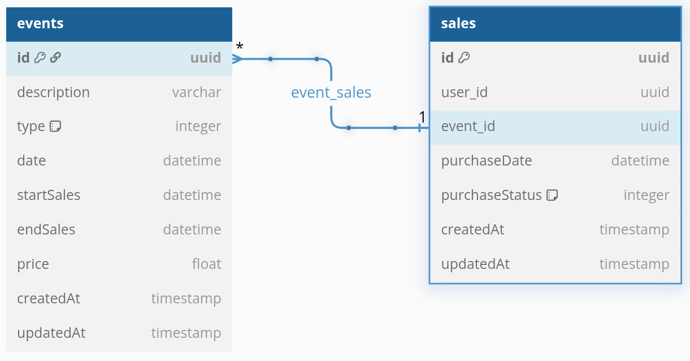

# CSI607 - Sistemas WEB II

## Período Letivo 2025/1

### Prof. Fernando Bernardes de Oliveira, Ph.D

---

## Atividade Prática 01 - Implementação do microsserviço de Vendas de Ingressos

A proposta desta atividade prática é o desenvolvimento do **microsserviço de vendas** (`Sales`) para a aplicação de Gerenciamentos de Tickets. Este microsserviço é responsável por registrar os eventos disponíveis e realizar a venda de ingressos para os usuários.

O modelo a seguir representa os atributos mínimos que devem ser considerados. Você pode utilizar outros atributos além deles; contudo, você não pode retirá-los ou renomeá-los. Você pode acessar também o modelo definido a partir do [DBDiagram](https://dbdiagram.io/d/Tickets-Sales-database-6863381bf413ba35089d90aa)

O **evento** possui um tipo (palestra, show, teatro, dentre outros), a respectiva descrição e a data/hora do evento. Além disso, existem as datas de início e fim do período de vendas dos ingressos. Por simplicidade, considere apenas um valor único para os ingressos.

A **venda** registra os ingressos adquiridos pelo usuário e indica se o pagamento foi efetuado corretamente ou não. Como estamos assumindo apenas pagamentos por cartão de crédito, em caso de falha ou negação pela operadora, o pagamento fica em aberto. Assim, é possível assumir status para a compra como: "Em aberto", "Pago", "Cancelado", "Estornado", dentre outros.

Implemente as operações de **CRUD** (*create, read, update, delete*) para as entidades. Você pode utilizar a arquitetura que foi definida no projeto `users`, mas não é obrigatório.

O microsserviço deve receber requisições e enviar respostas por meio de conteúdos `json`. Utilize como porta padrão o número `4000`.

O código deve ser disponibilizado num repositório no Github e o link desse repositório deve ser inserido no Moodle no tópico correspondente à atividade.

Crie um arquivo indicando os endpoints que foram definidos. Pode ser um documento Markdown ou um arquivo `.rest`, como realizado em sala de aula.

---

**Uma excelente atividade para vocês!**

---

***Let's code!***

> ***What we have to learn to do, we learn by doing.***  
>
> --- Aristóteles.
