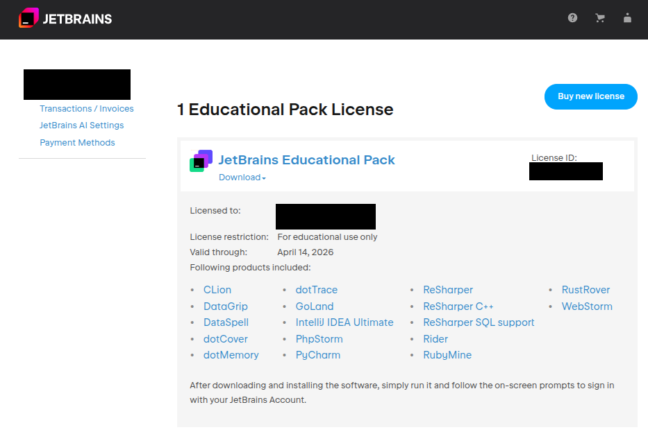

# Preparação do ambiente de desenvolvimento

## Considerações iniciais

Este documento apresenta uma sugestão de ambiente de desenvolvimento para utilização na disciplina. Vocês têm total autonomia para escolher outros sistemas operacionais, editores, bem como suas extensões, servidores e demais itens.

Nós utilizaremos nesta disciplina o ambiente [Java Spring Boot](https://spring.io/projects/spring-boot), um *framework* desenvolvido para agilizar o desenvolvimento de aplicações com o [Spring Framework](https://spring.io/projects/spring-framework).

Nós precisaremos das seguintes ferramentas para o desenvolvimento:

- Uma IDE/editor de código;
- Java JDK (versão 17 ou superior);
- Um sistema de banco de dados.

## Sistema operacional

Você pode optar em utilizar o [(~~R~~)Windows](https://media3.giphy.com/media/QSMBLRAHZTLkQ/giphy.gif) ou qualquer outro sistema operacional (~~que realmente preste~~). Eu sugiro que você avalie a possibilidade de utilizar alguma distribuição Linux para desenvolvimento, principalmente Web. [Escolha uma distribuição qualquer](https://distrowatch.com/) e prepare o seu ambiente.  

Segue uma sugestão de vídeo para ajudar na configuração do Ubuntu: [Fabio Akita - O Guia DEFINITIVO de UBUNTU para Devs Iniciantes](https://youtu.be/epiyExCyb2s). Em outros canais do [YouTube](https://www.youtube.com/), você encontrará também diversos tutoriais para diferentes distribuições.

## Editor

O editor que eu utilizarei na disciplina neste período é o [IntelliJ IDEA](https://www.jetbrains.com/idea/download) da [JetBrains](https://www.jetbrains.com/). Ele tem instalação para Windows, Linux e MacOS, além de diversas extensões e *plugins* que auxiliam no desenvolvimento. A JetBrains disponibiliza também uma ferramenta chamada [JetBrains Toolbox App](https://www.jetbrains.com/toolbox-app/) para instalação dos seus diferentes editores. Você pode utilizá-la para a instalação do Intellij, além dos outros editores.

Faça o download conforme a sua plataforma e instale o editor. O processo é simples e você não terá problemas com isso (~~nunca se sabe~~).

### Licença educacional JetBrains

A JetBrains disponibiliza licença educacional para utilização dos seus editores. Assim, por meio do seu e-mail institucional, você pode requisitar o seu [JetBrains Educational Pack](https://www.jetbrains.com/academy/student-pack/).


Caso você não possua, crie uma [conta no site da JetBrains](https://account.jetbrains.com/) e faça a requisição da sua licença. Você receberá um e-mail para confirmar a licença. Após isso, você verá uma imagem similar à seguinte com as informações sobre o licenciamento.



No editor, você realizará o login com as suas credenciais para que a licença seja inserida e você consiga utilizar todas as funcionalidades da versão *Ultimate*.

## Java JDK (*opcional para editores diferentes do IntelliJ*)

Se necessário, você pode fazer o download do Java JDK [aqui](https://www.oracle.com/java/technologies/downloads/) ou utilizar a instalação por meio de algum gerenciador de pacotes, como APT, SNAP, PacMan e afins. A **versão mínima** necessária é a 17.

Uma das vantagens de se utilizar o IntelliJ é que ele faz o download e o gerenciamento dos JDKs. Ele utiliza um cache particular para armazenar as versões e precisamos apenas indicar (ou baixar) conforme o caso.

## Sistema de banco de dados em *container*

Na disciplina, o sistema de banco de dados escolhido é o [PostgreSQL](https://www.postgresql.org/download/). A escolha foi feita considerando a integração com o *framework*, além de suportar diferentes bancos de dados para a arquitetura de microsserviços. Você pode instalar o PostgreSQL no seu computador e utilizá-lo também. Contudo, durante a disciplina será criado um arquivo do *Docker* para a criação de *containers* para o servidor de banco de dados e outras aplicações.

### Instalação do *Docker*

Um [*Docker*](https://www.docker.com/) é um ambiente que permite criar e executar amplicações em *containers*. Para isso, precisamos fazer a instalação do [*Docker Desktop* no Windows](https://docs.docker.com/desktop/setup/install/windows-install/) ou do [*Docker Engine* no Linux](https://docs.docker.com/engine/install/). Siga as instruções de instalação conforme o seu sistema operacional. Em geral, o processo é de instalação ocorre sem problemas (~~cruze os dedos por precaução~~).

Após a instalação, no Windows é preciso iniciar o *Docker Desktop* para que os serviços sejam carregados. No Linux, ele costuma ser carregado na inicialização do sistema.

Para verificar se o serviço foi iniciado corretamente (e os comandos estão disponíveis), abra o seu terminal ou similar, e digite:

```bash
docker --version
```

Se você tiver uma resposta similiar como a seguinte, está tudo correto:  

```bash
Docker version 27.1.1, build 6312585
```

Para verificar os *containers* que estão em execução, abra o seu terminal ou similar, e digite:

```bash
docker ps
```

Você deve ver uma mensagem com o seguinte cabeçalho:  

```bash
CONTAINER ID   IMAGE    COMMAND        CREATED         STATUS        PORTS   NAMES
```

Caso você tenha problemas com esses comandos, pode ser necessário verificar se o *Docker* está em execução ou, em situações mais extremas, reinstalar a aplicação. Caso você tenha algum dúvida para resolver isso, por favor, entre em contato.

### Dockerfile

O servidor de banco de dados e as outras aplicações serão criados por meio do *Dockerfile*. Ele é um arquivo de configuração que descreve como construir uma imagem. O arquivo [*docker-compose-dev.yml*](../Codes/tickets/docker/docker-compose-dev.yml) construído na aula está disponível [na pasta *docker* junto aos códigos](../Codes/tickets/docker/docker-compose-dev.yml). Observe que os [*scripts* para criação dos bancos de dados](../Codes/tickets/docker/) utilizados pelos microsserviços também estão disponíveis na pasta.

## Considerações finais

Existem diversas outras maneiras de preparar um ambiente de desenvolvimento conforme o que precisamos, além de realizar as ações diferente do que foi proposto. Se você conhece uma maneira mais prática, por favor, compartilhe a sua experiência.

Você pode contribuir com esse roteiro, seja com correções no texto, indicação de outros processos para instalação e tudo mais, me enviando um e-mail ou a partir de uma *issue* ou *pull request*. Veja sobre isso [aqui](https://docs.github.com/en/desktop/contributing-and-collaborating-using-github-desktop/creating-an-issue-or-pull-request). Todas as contribuições são muito bem-vindas!

Se você chegou até aqui e deu tudo certo:


Caso contrário, entre em contato, e:


Muito obrigado!  

**Um ótimo curso! E que a Força esteja com você!**  
