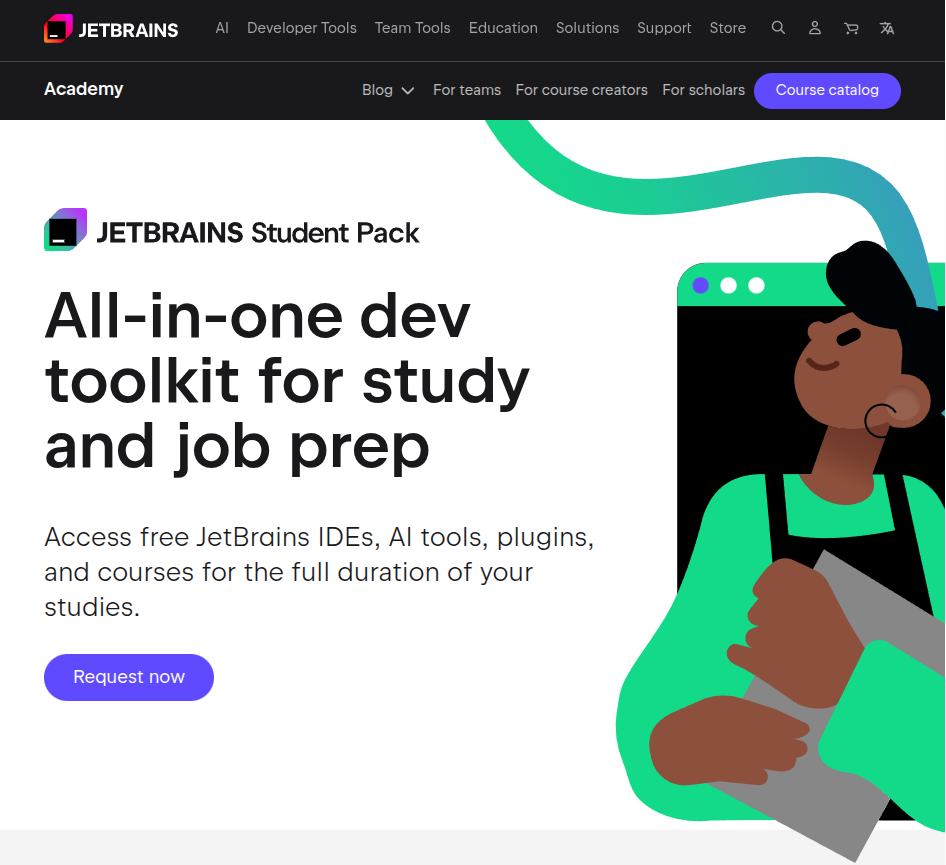

# Preparação do ambiente de desenvolvimento

## Considerações iniciais

Este documento apresenta uma sugestão de ambiente de desenvolvimento para utilização na disciplina. Vocês têm total autonomia para escolher outros sistemas operacionais, editores, bem como suas extensões, servidores e demais itens.

Nós utilizaremos nesta disciplina o ambiente [Java Spring Boot](https://spring.io/projects/spring-boot), um *framework* desenvolvido para agilizar o desenvolvimento de aplicações com o [Spring Framework](https://spring.io/projects/spring-framework).

Nós precisaremos das seguintes ferramentas para o desenvolvimento:

- Uma IDE/editor de código;
- O JDK do Java (versão 17 ou superior);
- Um sistema de banco de dados.

## Sistema operacional

Você pode optar em utilizar o [(~~R~~)Windows](https://media3.giphy.com/media/QSMBLRAHZTLkQ/giphy.gif) ou qualquer outro sistema operacional (~~que realmente preste~~). Eu sugiro que você avalie a possibilidade de utilizar alguma distribuição Linux para desenvolvimento, principalmente Web. [Escolha uma distribuição qualquer](https://distrowatch.com/) e prepare o seu ambiente.  

Segue uma sugestão de vídeo para ajudar na configuração do Ubuntu: [Fabio Akita - O Guia DEFINITIVO de UBUNTU para Devs Iniciantes](https://youtu.be/epiyExCyb2s). Em outros canais do [YouTube](https://www.youtube.com/), você encontrará também diversos tutoriais para diferentes distribuições.

## Editor

O editor que eu utilizarei na disciplina neste período é o [IntelliJ IDEA](https://www.jetbrains.com/idea/download) da [JetBrains](https://www.jetbrains.com/). Ele tem instalação para Windows, Linux e MacOS, além de diversas extensões e *plugins* que auxiliam no desenvolvimento. A JetBrains disponibiliza também uma ferramenta chamada [JetBrains Toolbox App](https://www.jetbrains.com/toolbox-app/) para instalação dos seus diferentes editores. Você pode utilizá-la para a instalação do Intellij, além dos outros editores.

Faça o download conforme a sua plataforma e instale o editor. O processo é simples e você não terá problemas com isso (~~nunca se sabe~~).

### Licença educacional JetBrains

A JetBrains disponibiliza licença educacional para utilização dos seus editores. Assim, por meio do seu e-mail institucional, você pode requisitar o seu [JetBrains Educational Pack](https://www.jetbrains.com/academy/student-pack/).

Caso você não possua, crie uma [conta no site da JetBrains](https://account.jetbrains.com/) e faça a requisição da sua licença.